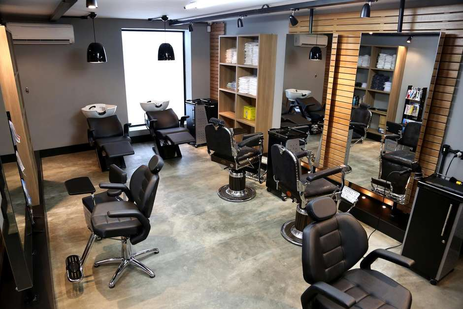

<h3 align="center">
  
</h3>

<h3 align="center">
:computer: Desenvolvendo um projeto WEB :computer:
</h3>

- Uma plataforma web onde você poderá se cadastrar como pessoa (cliente) ou cadastrar o seu próprio estabelecimento (salão). Onde como cliente você poderá encontrar estabelecimentos, realizar agendamentos online, avaliações, etc. E como salão você poderá cadastrar as atividades que o seu estabelecimento exerce, cadastrar os profissionais que trabalham nele, deixar disponíveis imagens, etc.

### :hammer_and_wrench: Tecnologias utilizadas:
- React JS;
- Heroku para conexão das APIs

<h3 align="center">
  :checkered_flag: Startando o projeto :checkered_flag:
</h3>

1° Clonar o projeto: `git clone https://github.com/leopacciulli/Hair-Shop.git`

<br>

2° Startar o projeto:

```sh
$ npm install
$ npm start
```

---

Autor: [Leonardo Pacciulli](https://www.linkedin.com/in/leonardo-pacciulli-a4b86a92/)
